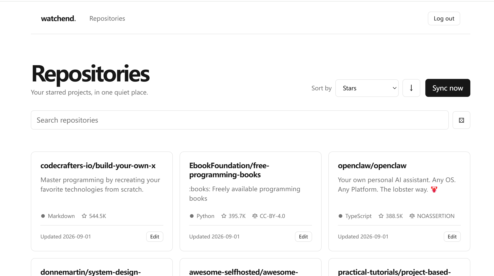

# watchend

一个极简的单用户自托管 GitHub Stars 管理应用。

watchend 会同步你的 GitHub Star 仓库，并以卡片形式集中展示。你可以搜索和排序仓库，编辑个人 Note、Categories 和 Tags，也可以随机打开一个感兴趣的仓库。



## 特性

- 用户名和密码登录
- GitHub Star 仓库同步及后台自动同步
- 仓库搜索、排序和分页加载
- Note、Categories 和 Tags 管理
- 随机仓库访问
- SQLite 数据存储
- Docker 镜像和 GHCR 发布支持

## 技术栈

- Go
- SQLite
- Go templates
- HTMX
- Docker

## 快速开始

使用 GHCR 镜像：

```sh
docker run -d \
  --name watchend \
  -p 3000:3000 \
  -v ./watchend/data:/data \
  -e WATCHEND_ADMIN_PASSWORD='your-password' \
  -e WATCHEND_GITHUB_TOKEN='your-github-token' \
  -e WATCHEND_SECURE_COOKIES='false' \
  ghcr.io/Cusox/watchend:latest
```

然后访问 `http://localhost:3000`。默认管理员用户名为 `admin`。

本地开发需要 Go 1.25 或更高版本：

```sh
WATCHEND_DATABASE_PATH=./watchend.db \
WATCHEND_ADMIN_PASSWORD='your-password' \
WATCHEND_GITHUB_TOKEN='your-github-token' \
WATCHEND_SECURE_COOKIES=false \
go run ./cmd/watchend
```

## 配置

主要配置项：

- `WATCHEND_ADMIN_PASSWORD`：管理员密码
- `WATCHEND_GITHUB_TOKEN`：GitHub API Token
- `WATCHEND_DATABASE_PATH`：SQLite 数据库路径
- `WATCHEND_ADDR`：监听地址，默认为 `:3000`
- `WATCHEND_SYNC_INTERVAL`：后台同步间隔，默认为 `6h`
- `WATCHEND_SECURE_COOKIES`：是否启用 Secure Cookie，HTTPS 环境应保持启用
